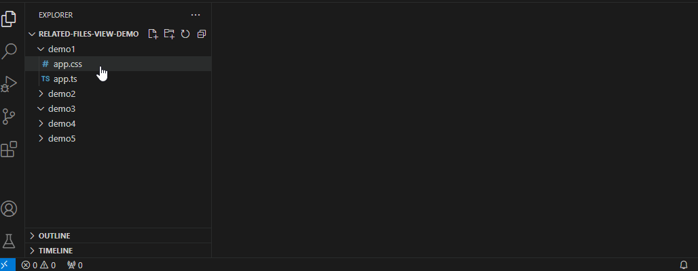

# related-file-view README

Related Files View is a VSCode extension that allows the automated opening and closing of related files (same name, different file extension) in a seperate editor column.

## Features

* Assigns a dedicated editor view for "related files"
* Automatically searches for and opens related files as you change files.
* Can select search folder root as: sibling, parent, project root, or custom.
* Can customise which file extensions to use.
* Can exclude specific files or folders.

## Usage

## Installation

Currently this extension is only availiable for manual install. Download the latest vsix file. Go to `Extensions > Install from VSIX...` and select the downloaded file.

## Extension Settings

This extension contributes the following settings:

* `relatedfileview.showInitialised`: Determines wether or not to show a notification when the extension becomes active.
* `relatedfileview.activationMode`: Determines when to open related files for a document.
* `relatedfileview.searchMode`: Determines where the file search for related files should originate.
* `relatedfileview.searchSubFolders`: Determines wether or not to search subfolders for related files.
* `relatedfileview.customSearchGlobs`: Determines any custom globs (folder paths) to search.
* `relatedfileview.includedFileExtensions`: Determines which file extensions should be considered for opening in the related file view.
* `relatedfileview.excludedFiles`: Determines which files to exclude from opening in the related file view.

## Issues

Extensive testing has yet to be done.

Contributions, issues and feature requests are welcome!

## License

Related Files View - A VSCode Extension.
Copyright (C) 2024  Kye Gregory

This program is free software: you can redistribute it and/or modify
it under the terms of the GNU General Public License as published by
the Free Software Foundation, either version 3 of the License, or
(at your option) any later version.

This program is distributed in the hope that it will be useful,
but WITHOUT ANY WARRANTY; without even the implied warranty of
MERCHANTABILITY or FITNESS FOR A PARTICULAR PURPOSE.  See the
GNU General Public License for more details.

You should have received a copy of the GNU General Public License
along with this program.  If not, see <https://www.gnu.org/licenses/>.

## Author

Kye Gregory - [github page](https://github.com/kye-gregory/)